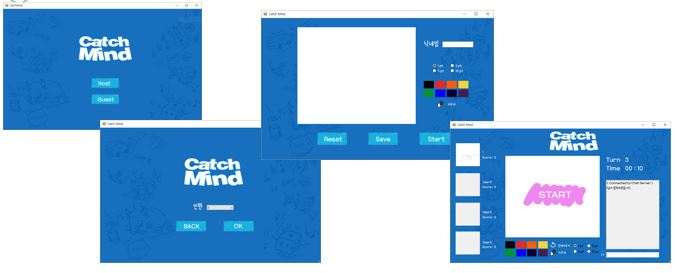

# CatchMind

- Implement the catchmind game that you can easily enjoy using .NET Framework C#.

## Functions
1. Host and Guest can be selected (Host: Server, Guest: Client)
2. Host: Maximum number of people (2 ~ 4)
3. Guest: Selectable room
4. Your profile Custom
5. Chat among users
6. RANKING after game is over.

### Require
- C#, AWS
